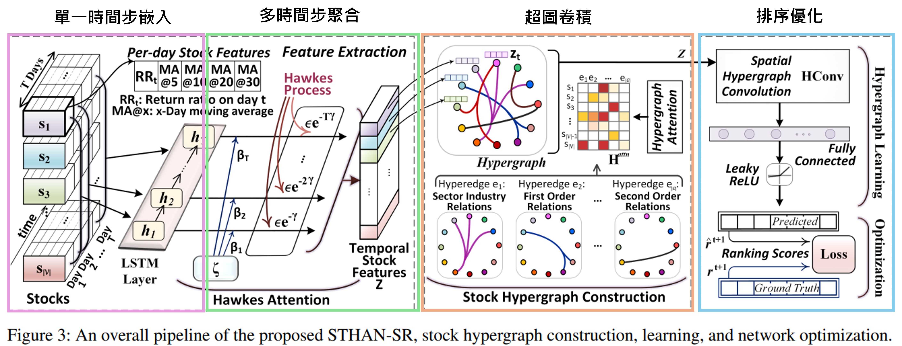
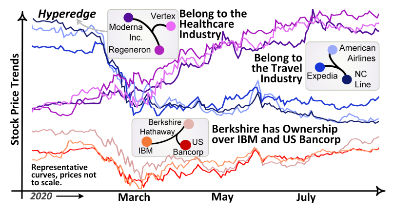
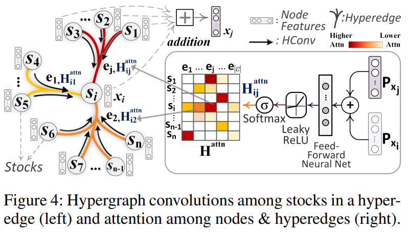
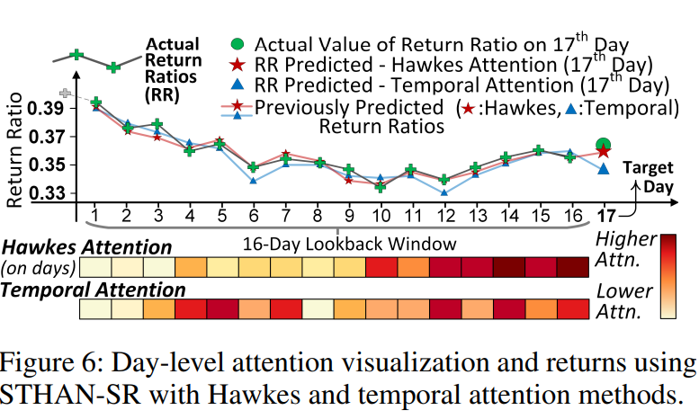
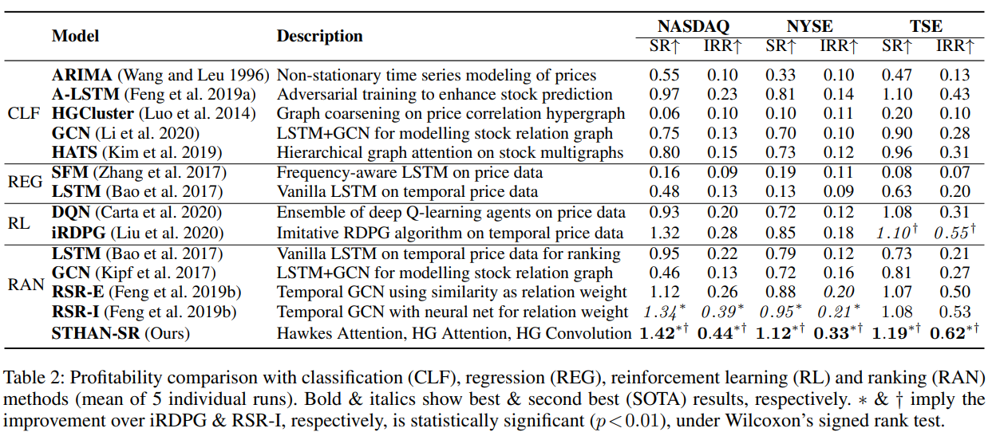
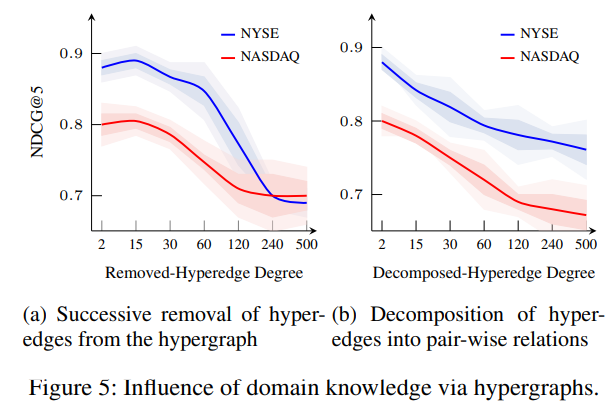
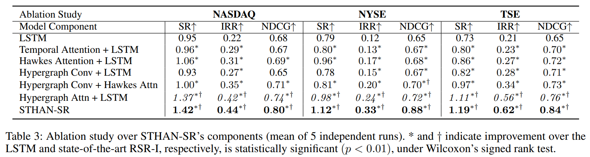

# 論文資訊
作者: Ramit Sawhney, Shivam Agarwal, Arnav Wadhwa, Tyler Derr, and Rajiv Ratn Shah

發表日期: 2021年5月18日

會議/期刊: Proceedings of the AAAI Conference on Artificial Intelligence (AAAI 2021), Volume 35, Number 1, pages 497-504

引用數量: 65次

DOI: 10.1609/aaai.v35i1.16127

Link: [論文原文](https://ojs.aaai.org/index.php/AAAI/article/view/16127)、[論文程式碼](https://github.com/NDS-VU/STHAN-SR-AAAI21)


# 研究動機
在金融市場，股票存在群體關係（同產業的股票、同一位CEO管理的公司、母子公司關係），例如在COVID-19期間，旅遊業股票集體下跌，而醫療保健類股票集體上漲，但大多數方法將每支股票視為獨立個體，即使有考慮關聯性，也僅使用簡單的成對關係圖結構，**將這種集體關係拆解成多條兩兩之間的邊(節點-節點)**，例如10家公司都屬於醫療產業，就會產生 45(C10取2) 條邊，無法直接表達這10家公司屬於同一個群體，而**超圖則能用單一條超邊將這10家公司連結在一起(節點-超邊)**，可以直接表達這些公司同屬醫療產業的群體關係，**在進行超圖卷積時，同一超邊內的所有股票特徵會先聚合成超邊特徵，再傳遞回各節點，使得群體內的資訊能夠完整保留並有效傳播**。

此外，傳統方法將股票預測建構為分類或迴歸問題，並未直接針對獲利進行優化，導致預測準確的模型不一定能選出最賺錢的股票，因此作者將問題重新定義為**排序學習，透過結合報酬率迴歸損失與成對排序損失的目標函數**，同時確保預測值接近真實報酬率，並維持高報酬股票排在前面，直接針對選股獲利的最終目標進行訓練。

# 方法論
這篇論文提出了 STHAN-SR（Spatio-Temporal Hypergraph Attention Network for Stock Ranking）框架。

### STHAN-SR
模型首先利用 LSTM 捕捉各股票的歷史價格序列特徵，並結合 Hawkes 注意力機制動態調整時間權重，以模擬資訊影響力隨時間衰減的特性，生成的序列嵌入向量將作為初始節點特徵輸入超圖注意力卷積層，透過超圖卷積更新節點嵌入向量，讓節點涵蓋與其關聯的股票的序列資訊，模型也得以學習股票間複雜的高階關聯性及其重要程度，最終產出每支股票的預測報酬率。


### 序列嵌入(Sequential Embedding)
#### 單一時間步嵌入(LSTM/GRU)
在介紹解決方法超圖卷積之前，要先決定輸入圖卷積的節點特徵，作者5個特徵，包括昨日報酬率、長短期趨勢(5、10、20、30日移動平均) 合併成一個向量 $q_\tau \in \mathbb{R}^5$輸入LSTM/GRU(論文描述LSTM，但實作為GRU)生成時間步嵌入向量。

```python
# train/hgat_nasdaq.py
class HGAT(torch.nn.Module):
    def __init__(self, tickers):
        self.grup = gru(5, 32)       

    def forward(self, price_input, e):
        context, query = self.grup(price_input) 
        query = query.reshape(1026, 1, 32)
```

#### 多時間步聚合(LSTM/GRU)
在透過 LSTM/GRU 得出包含歷史資訊的每一時間步隱藏狀態後，為了生成節點的序列嵌入向量，這篇論文採用兩種注意力機制來衡量上一步驟生成的不同時間步的重要性，分別是 Temporal Attention、Hawkes Attention，前者讓模型自由學習哪些天重要 Temporal Attention，如公式2：

$$\zeta(\bar{h}_t) = \sum_{\tau} \lambda_\tau, \quad \lambda_\tau = \beta_\tau h_\tau, \quad \beta_\tau = \frac{\exp(h_\tau^T W \bar{h}_t)}{\sum_{\tau} \exp(h_\tau^T W \bar{h}_t)}$$

- $h_\tau$：第 $\tau$ 天的 LSTM 隱藏狀態
- $\beta_\tau$：學習到的注意力權重
- $\lambda_\tau$：加權後的日層級表示

也就是說，在衡量不同交易日時，Temporal Attention 不會考慮時間因素，權重來源純粹由內容相似度(過去交易日的特徵 $h_\tau$與預測目標日的特徵 $\bar{h}_t$之間的相似程度)決定。
```python
# train/hgat_nasdaq.py
def forward(self, query, context):
    # query: 最後一天的隱藏狀態 (預測目標)
    # context: 所有歷史天數的隱藏狀態
    
    if self.attention_type == "general":
        query = self.linear_in(query)  # 對應 W 變換
    
    # 計算相似度分數
    attention_scores = torch.bmm(query, context.transpose(1, 2).contiguous())
    
    # Softmax 得到權重
    attention_weights = self.softmax(attention_scores)
```
而 Hawkes Attention，則是在原本的 $\lambda_\tau$ 基礎上，額外加入一個**激勵-衰減項**，如公式3：

$$z_t = \sum_{\tau=0, \Delta t_\tau \geq 0} \left( \lambda_\tau + \epsilon \cdot \max(\lambda_\tau, 0) \cdot e^{-\gamma \Delta t_\tau} \right)$$


- $\epsilon$：激勵參數控制近期事件影響的放大程度
- $\gamma$：衰減參數控制影響力衰減的速度
- $\Delta t_\tau$：當前時間與過去時間 τ 的時間差
- $e^{-\gamma \Delta t_\tau}$：越久遠的事件，影響力衰減越多
- $z_t$：最終時間特徵
- $\lambda_\tau$：Temporal Attention單一時間步的加權隱藏狀態($\beta_\tau h_\tau$)。

透過添加激勵-衰減項，模型假設時間越近的事件(上漲/下跌)對當前股票價格影響越大，且影響力會隨著時間進行衰減。

```python
# train/hgat_nyse.py
class Attention(torch.nn.Module):
    def __init__(self, dimensions, attention_type='general'):
        ...
        # Hawkes 參數
        self.ae = torch.nn.Parameter(torch.FloatTensor(1737,1,1))  # 激勵參數 ε
        self.ab = torch.nn.Parameter(torch.FloatTensor(1737,1,1))  # 衰減參數 γ

    def forward(self, query, context):
        ...
        mix = attention_weights * (context.permute(0,2,1))
        
        # Hawkes Attention 核心計算
        delta_t = torch.flip(torch.arange(0, query_len), [0]).type(torch.float32).to('cuda')  # 時間差 Δt
        delta_t = delta_t.repeat(1737,1).reshape(1737,1,query_len) # 時間差 [T-1, T-2, ..., 1, 0]
        bt = torch.exp(-1 * self.ab * delta_t)           # e^(-γΔt) 每支股票用自己的 γ 對所有時間步計算衰減
        term_2 = F.relu(self.ae * mix * bt)              # ε * max(λ,0) * e^(-γΔt)
        mix = torch.sum(term_2 + mix, -1).unsqueeze(1)   # 聚合
        ...
```


簡單來說，Temporal 由 **$\lambda_\tau$** 單純加權總合基礎的時間注意力分組成; Hawkes 是添加 **$\epsilon \cdot \max(\lambda_\tau, 0) \cdot e^{-\gamma \Delta t_\tau}$** 後的 $\lambda_\tau$ 加權總合。

flip 語法範例
```python
delta_t = torch.flip(torch.arange(0, query_len), [0])
```

- `torch.arange(0, query_len)` 產生 `[0, 1, 2, ..., T-1]`
- `torch.flip(..., [0])` 翻轉後變成 `[T-1, T-2, ..., 1, 0]`


另外，從參數的定義我們可以發現，每支股票都有一組參數，也就是不同股票有不同的時間敏感度，如果一支股票的屬性為高 $\epsilon$、高 $\gamma$（近期影響大但衰減快），代表該股票屬於高波動成長股，反之則為穩定藍籌股。
```python
# train/hgat_nyse.py
# 以 NYSE 為例（1737 支股票）
self.ae = torch.nn.Parameter(torch.FloatTensor(1737, 1, 1))  # 激勵參數
self.ab = torch.nn.Parameter(torch.FloatTensor(1737, 1, 1))  # 衰減參數
```
這些參數在每次反向傳播都會更新，並在測試時使用訓練後的固定參數。

訓練階段
```python
# train/train_hgat_tse.py
model.train()
for j in range(self.valid_index - self.parameters['seq'] - self.steps + 1):
    optimizer_hgat.zero_grad()
    output = model(...)
    cur_loss.backward()
    optimizer_hgat.step()  # 更新所有參數，包括 ae、ab
```

測試階段

```python
# train/train_hgat_tse.py
model.eval()  # 切換到評估模式
with torch.no_grad():  # 不計算梯度
    output_test = model(...)
```

### 關係嵌入(Relational Embedding)
#### 定義超圖（Hypergraph）
作為超圖的基礎連接單位超邊（hyperedge），可以同時連接任意數量的節點，論文依據 GICS（全球行業分類標準）來定義產業超邊，所有屬於同一產業的股票會被一條超邊連接起來，以下圖的醫療行業為例，就包括股票 Vertex、Moderna、Regeneron，這些被同一超邊連接的股票會**呈現同步的價格趨勢**，如之前提到的 COVID 案例。



而這個超邊被定義在關聯矩陣，如(公式4):

$$h(v, e) = \begin{cases} 1, & v \in e \\ 0, & v \notin e \end{cases}$$

這個矩陣記錄的是「哪些節點屬於哪條超邊」，維度維節點數 × 超邊數，如果是鄰接矩陣，當當產業內有 100 支股票時，需要建立 C(100,2) = 4,950 條邊，而關聯矩陣只需要 1 條超邊、100 個標記。

這就是為什麼超圖能更有效地表達「集體關係」，而不會造成資訊分散到大量成對邊中。


```python
# train/train_nasdaq.py
inci_mat = np.load('nasdaq.npy') # [1026,862]
inci_sparse = sparse.coo_matrix(inci_mat)
incidence_edge = utils.from_scipy_sparse_matrix(inci_sparse)

# from_scipy_sparse_matrix 會將稀疏矩陣轉換為 PyTorch Geometric 的邊索引格式 `[2, num_edges]`，其中記錄所有 (節點, 超邊) 的連接關係
# https://pytorch-geometric.readthedocs.io/en/2.5.3/modules/utils
edge_index = torch.tensor([
    [0, 1, 1, 2, 2, 3],
    [1, 0, 2, 1, 3, 2],
])
adj = to_scipy_sparse_matrix(edge_index)
# `edge_index` and `edge_weight` are both returned
from_scipy_sparse_matrix(adj)
(tensor([[0, 1, 1, 2, 2, 3],
        [1, 0, 2, 1, 3, 2]]),
tensor([1., 1., 1., 1., 1., 1.]))
```

有了這個超圖結構，就可以將架構輸入模型以此更新節點


```python
# train/train_nasdaq.py
output = model(torch.FloatTensor(emb_batch).to(device), incidence_edge[0].to(device))
```

#### 定義超圖卷積層（HypergraphConv）
在超圖卷積運算中，每支股票根據同一超邊內其他股票的資訊來更新節點嵌入向量，這樣同一產業的股票就能透過共享的超邊交換資訊，另外，PyG 的 HypergraphConv 可以指定是否使用卷積注意力，讓模型學習**每條超邊對每支股票的重要程度**不同，這樣可以區分出哪些產業關係對特定股票的價格預測更為關鍵，例如，對科技股而言，「同屬科技行業」的超邊可能更重要，對金融股而言，「同一母公司」的超邊可能更重要，運作方式如公式8：

$$\mathbf{X}^{(l+1)} = \bigoplus_{k=1}^{K} \text{ELU}\left(\mathbf{D}_v^{-\frac{1}{2}} \mathbf{H}^{at}_k \mathbf{W} \mathbf{D}_e^{-1} \mathbf{H}^{at^T}_k \mathbf{D}_v^{-\frac{1}{2}} \mathbf{X}^{(l)} \mathbf{P}_k\right)$$

- $\mathbf{X}^{(l)}$：第 $l$ 層的節點特徵矩陣，維度 $\mathbb{R}^{|V| \times F^{(l)}}$
- $\mathbf{X}^{(l+1)}$：第 $l+1$ 層的節點特徵矩陣（輸出），維度 $\mathbb{R}^{|V| \times F^{(l+1)}}$
- $\mathbf{D}_v$：節點度數對角矩陣，$d_v$ = 節點參與的超邊數量，維度 $\mathbb{R}^{|V| \times |V|}$
- $\mathbf{D}_v^{-1/2}$：節點度數正規化矩陣，維度 $\mathbb{R}^{|V| \times |V|}$
- $\mathbf{D}_e$：超邊度數對角矩陣，$d_e$ = 超邊包含的節點數量，維度 $\mathbb{R}^{|\mathcal{E}| \times |\mathcal{E}|}$
- $\mathbf{D}_e^{-1}$：超邊度數正規化矩陣，維度 $\mathbb{R}^{|\mathcal{E}| \times |\mathcal{E}|}$
- $\mathbf{W}$：超邊權重對角矩陣，維度 $\mathbb{R}^{|\mathcal{E}| \times |\mathcal{E}|}$
- $\mathbf{H}^{at}_k$：第 $k$ 個 head 的 attention 加權關聯矩陣，維度 $\mathbb{R}^{|V| \times |\mathcal{E}|}$
- $\mathbf{H}^{at^T}_k$：$\mathbf{H}^{at}_k$ 的轉置，維度 $\mathbb{R}^{|\mathcal{E}| \times |V|}$
- $K$：multi-head attention 的 head 數量
- $\mathbf{P}_k$：第 $k$ 個 head 的特徵變換矩陣，維度 $\mathbb{R}^{F^{(l)} \times F^{(l+1)}}$
- $\bigoplus$：多頭結果合併操作（concat 或平均）
- $\text{ELU}$：非線性激活函數


節點更新分成三個階段:
**第一階段：節點 → 超邊**

**Step 1：$\tilde{\mathbf{X}}_k = \mathbf{X}^{(l)} \mathbf{P}_k$**
先做特徵變換，將節點特徵投影到第 $k$ 個 head 的特徵空間。

**Step 2：$\mathbf{D}_v^{-1/2} \tilde{\mathbf{X}}_k$**
對每個節點特徵按其度數做正規化，度數高的節點特徵被縮小。

**Step 3：$\mathbf{H}^{at^T}_k (\mathbf{D}_v^{-1/2} \tilde{\mathbf{X}}_k)$**
將節點特徵聚合到超邊，$\mathbf{H}^{at^T}_k$ 以 attention 權重加權聚合同一超邊內的節點特徵。
結果維度：$\mathbb{R}^{|\mathcal{E}| \times F^{(l+1)}}$（每個超邊一個特徵向量）

---

**第二階段：超邊 → 節點**

**Step 4：$\mathbf{D}_e^{-1} (\mathbf{H}^{at^T}_k \mathbf{D}_v^{-1/2} \tilde{\mathbf{X}}_k)$**
對超邊特徵做正規化，除以超邊包含的節點數（取平均）。

**Step 5：$\mathbf{W} (\mathbf{D}_e^{-1} \mathbf{H}^{at^T}_k \mathbf{D}_v^{-1/2} \tilde{\mathbf{X}}_k)$**
對超邊特徵乘上超邊權重。

**Step 6：$\mathbf{H}^{at}_k (\mathbf{W} \mathbf{D}_e^{-1} \mathbf{H}^{at^T}_k \mathbf{D}_v^{-1/2} \tilde{\mathbf{X}}_k)$**
超邊特徵傳回節點，$\mathbf{H}^{at}_k$ 以 attention 權重加權聚合每個節點所屬的超邊特徵。
結果維度：$\mathbb{R}^{|V| \times F^{(l+1)}}$（回到節點層級）

**Step 7：$\mathbf{D}_v^{-1/2} (\cdot)$**
再次對節點做度數正規化。

---

**第三階段：多頭合併與激活**

**Step 8：ELU 激活**
對每個 head 的輸出施加 ELU 非線性激活函數。

**Step 9：$\bigoplus_{k=1}^{K}$**
將 $K$ 個 head 的結果合併（concat 或平均），得到最終輸出 $\mathbf{X}^{(l+1)}$。

---

作者使用 PyG 預定義的卷積層 HypergraphConv
```python
# train/hgat_nasdaq.py
self.hatt1 = nn.HypergraphConv(32, 32, use_attention=True, heads=4, ...)
self.hatt2 = nn.HypergraphConv(32, 32, use_attention=True, heads=1, ...)

def forward(self, price_input, e):
    # ... 時序特徵提取 ...
    output = output.reshape((1026, 32))
    x = F.leaky_relu(self.hatt1(output, e), 0.2)  # 第一層超圖卷積
    x = F.leaky_relu(self.hatt2(x, e), 0.2)       # 第二層超圖卷積
    return F.leaky_relu(self.liear(x))
```

在官方的 HypergraphConv 類別程式碼，可以看清楚的看到這三個階段
```
# https://pytorch-geometric.readthedocs.io/en/2.6.0/_modules/torch_geometric/nn/conv/hypergraph_conv.html

class HypergraphConv(MessagePassing):
    
    def __init__(self, ...):
        ...

    def forward(self, x: Tensor, hyperedge_index: Tensor,
                hyperedge_weight: Optional[Tensor] = None,
                hyperedge_attr: Optional[Tensor] = None,
                num_edges: Optional[int] = None) -> Tensor:
        
        num_nodes = x.size(0)
        
        if num_edges is None:
            ...

        if hyperedge_weight is None:
            hyperedge_weight = x.new_ones(num_edges)  # 超邊權重矩陣

        x = self.lin(x)  # 節點特徵變換

        alpha = None
        if self.use_attention:
            assert hyperedge_attr is not None
            x = x.view(-1, self.heads, self.out_channels)  # 拆成 K 個 head
            hyperedge_attr = self.lin(hyperedge_attr)
            hyperedge_attr = hyperedge_attr.view(-1, self.heads, self.out_channels)
            x_i = x[hyperedge_index[0]]  # 節點特徵
            x_j = hyperedge_attr[hyperedge_index[1]]  # 超邊特徵
            alpha = (torch.cat([x_i, x_j], dim=-1) * self.att).sum(dim=-1)  # 計算 attention 分數
            alpha = F.leaky_relu(alpha, self.negative_slope)
            if self.attention_mode == 'node':
                alpha = softmax(alpha, hyperedge_index[1], num_nodes=num_edges)  # attention 權重（對超邊內節點做 softmax）
            else:
                alpha = softmax(alpha, hyperedge_index[0], num_nodes=num_nodes)
            alpha = F.dropout(alpha, p=self.dropout, training=self.training)

        # 節點度數矩陣（每個節點參與多少超邊）
        D = scatter(hyperedge_weight[hyperedge_index[1]], hyperedge_index[0],
                    dim=0, dim_size=num_nodes, reduce='sum')
        D = 1.0 / D  # 節點正規化係數
        D[D == float("inf")] = 0

        # 超邊度數矩陣（每個超邊包含多少節點）
        B = scatter(x.new_ones(hyperedge_index.size(1)), hyperedge_index[1],
                    dim=0, dim_size=num_edges, reduce='sum')
        B = 1.0 / B  # 超邊正規化係數
        B[B == float("inf")] = 0

        # 第一階段：節點 → 超邊
        out = self.propagate(hyperedge_index, x=x, norm=B, alpha=alpha,
                             size=(num_nodes, num_edges))
        
        # 第二階段：超邊 → 節點
        out = self.propagate(hyperedge_index.flip([0]), x=out, norm=D,
                             alpha=alpha, size=(num_edges, num_nodes))

        # 第三階段：多頭合併
        if self.concat is True:
            out = out.view(-1, self.heads * self.out_channels)  # concat 合併
        else:
            out = out.mean(dim=1) 

        if self.bias is not None:
            out = out + self.bias

        return out

    def message(self, x_j: Tensor, norm_i: Tensor, alpha: Tensor) -> Tensor:
        H, F = self.heads, self.out_channels
        out = norm_i.view(-1, 1, 1) * x_j.view(-1, H, F)  # 乘上正規化係數

        if alpha is not None:
            out = alpha.view(-1, self.heads, 1) * out  # 乘上 attention 權重

        return out
```

### 實驗設定
使用16天的股票特徵(5種短長期趨勢)，預測第17天的報酬率(含排序)
NASDAQ/NYSE 時間軸：
* 2013/01 ~ 2016/01：訓練期（756天）
* 2016/01 ~ 2017/01：驗證期（252天）
* 2017/01 ~ 2017/12：測試期（237天）

TSE 時間軸：
* 2015/11 ~ 2018/08：訓練期（693天）
* 2018/08 ~ 2019/07：驗證期（231天）
* 2019/07 ~ 2020/08：測試期（235天）

```python
# train/hgat_nasdaq.py
for j in range(self.valid_index - self.parameters['seq'] - self.steps + 1):
    emb_batch = self.eod_data[:, offset:offset + seq_len, :]

    ...
    
def get_batch(self, offset=None):
    seq_len = self.parameters['seq']
    
    # 回望窗口：取 seq_len 天的歷史資料作為輸入
    self.eod_data[:, offset:offset + seq_len, :]
    
    # 預測窗口：預測 steps 天後的報酬率
    self.gt_data[:, offset + seq_len + self.steps - 1]

```
# 研究結果
### Hawkes 能捕捉近期的趨勢變化
Hawkes 注意力能準確捕捉**近期的趨勢變化**（窗口末端的上漲），而一般時間注意力 Temporal Attention 權重分散，反映整體趨勢但錯失近期轉折，在預測成效，Hawkes 預測更接近實際值。


### 模型表現顯著優秀
在三個市場（NASDAQ、NYSE、東京證交所）超過六年的數據測試中，STHAN-SR 在所有評估指標上都顯著優於基準方法（p < 0.01）。


### 超圖優於普通圖
實驗按照度數由小到大依序移除超圖邊，排名能力明顯下降，而當超圖邊被分解為成對關係時，排名能力也明顯下降。


### 各模組相輔相成
消融實驗顯示，時序（Hawkes 注意力）和空間（超圖卷積 + 注意力）模組的結合，比單獨使用任一模組都能更好地捕捉股市中的時空相關性。

